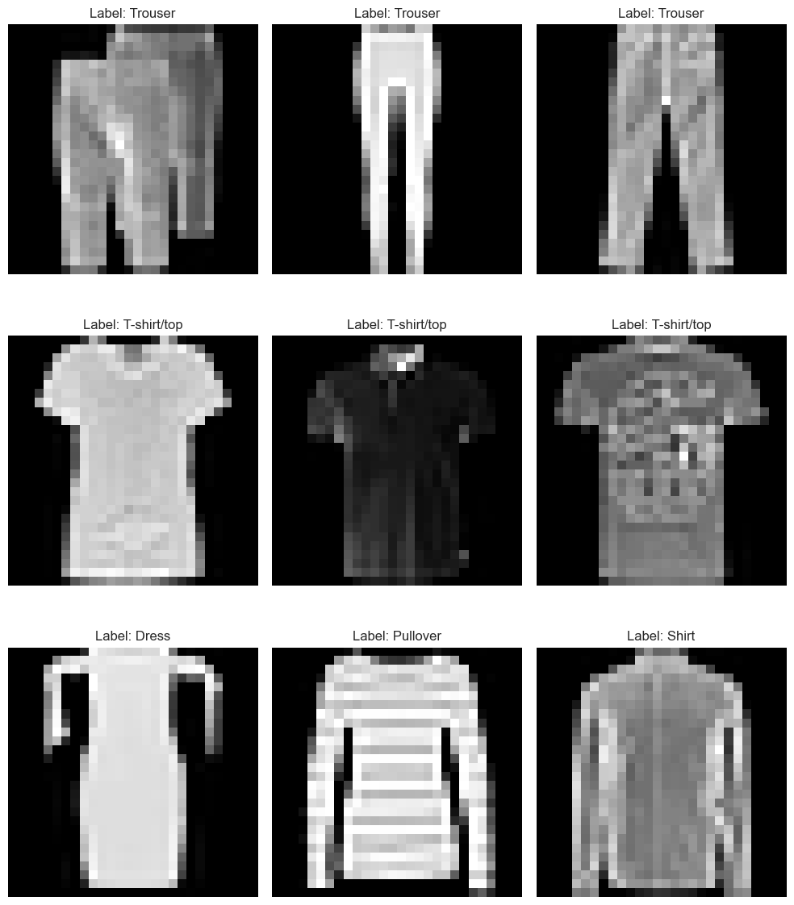

# Fashion-MNIST Analysis


**Project website: [satvikpraveen.github.io/FashionMNIST-Analysis](https://satvikpraveen.github.io/FashionMNIST-Analysis/)**

A reproducible empirical study of image classification on Fashion-MNIST:
what a modern training recipe, pretrained backbones and seed ensembles
actually buy on a small grayscale benchmark, and what they cost in
calibration and robustness.

Every number below is a mean over 3–5 random seeds on the official
10,000-image test set, with 95% confidence intervals, and comparisons are
tested **paired by seed**. Every run records its git commit, full config and
per-epoch curves, and every table links to the raw per-run data in
[`results/sweeps/`](results/sweeps/).

---

## Headline results

| Model | Test accuracy | Params | Notes |
|---|---|---|---|
| Pretrained ViT-Tiny/16 (224 px) | **0.9528 ± 0.0009** | 5.4M | ImageNet weights via timm; 3 seeds |
| Pretrained ConvNeXt-Tiny | 0.9503 ± 0.0008 | 27.8M | 3 seeds |
| 5-seed ensemble of TinyVGG, no random crop | 0.9421 | 5 × 0.14M | best result without pretraining |
| ResNet-18 (custom, from scratch) | 0.9412 ± 0.0018 | 11.2M | best single model without pretraining |
| TinyVGG, no random crop | 0.9362 ± 0.0036 | 0.14M | best recipe for the small CNNs |
| MiniCNN, no random crop | 0.9236 ± 0.0056 | 0.11M | |
| TinyVGG, default recipe | 0.9273 ± 0.0035 | 0.14M | |
| MiniCNN, default recipe | 0.9090 ± 0.0042 | 0.11M | |
| Best classical model (kNN on PCA features) | 0.8576 | – | single run, from the notebooks |

All rows use the corrected augmentation pipeline described in
[Methods and corrections](#methods-and-corrections).

## Main findings

1. **Pretraining is what moves accuracy past about 94%.** ImageNet weights
   improve every backbone family on every seed, by +1.3 to +3.8 points for
   CNNs and +15.6 points for ViT-Tiny, which trained from scratch collapses
   to 0.80.
2. **Among from-scratch models, ResNet-18 is clearly best** (0.9412), ahead
   of TinyVGG with non-overlapping confidence intervals. The original
   single-seed claim that TinyVGG was best does not hold.
3. **Whether random cropping helps depends on model capacity.** Removing
   the padded random crop gains +1.5 points for MiniCNN and +1.0 for TinyVGG
   (both about 0.1M parameters) but costs ResNet-18 (11M) 0.5 points and
   pretrained ViT-Tiny (5.4M) 0.3 points, on every seed. Removing rotation also helps TinyVGG (+0.6). Fashion-MNIST
   items are centred and size-normalised, so shifts mostly add noise for a
   small model, while a large one benefits from the regularisation.
4. **Seed ensembles add 0.6 to 1.8 points, but can harm calibration.**
   Averaging makes calibration worse when members were trained with
   Mixup/CutMix and better when they were not, reproducing
   Wen et al. (ICLR 2021).
5. **Clean accuracy hides robustness differences.** ResNet and TinyVGG had
   near-identical clean accuracy on the pre-fix pipeline, but ResNet's error
   under contrast and brightness shifts was 0.16–0.17 lower. Random cropping
   trades contrast and noise robustness for translation robustness.
6. **The default learning rate and weight decay are already optimal**, so
   hyper-parameter tuning is not where the remaining accuracy is.

Two bugs were found and fixed while running the study: an accuracy metric
that over-weighted the last batch, and an augmentation pipeline that applied
one random transform per batch with grey padding. Both are described, with
their measured effect, in [Methods and corrections](#methods-and-corrections).

---

## Quick start

```bash
git clone https://github.com/SatvikPraveen/FashionMNIST-Analysis.git
cd FashionMNIST-Analysis
python -m venv venv && source venv/bin/activate
pip install -r requirements.txt          # or cluster/requirements-cluster.txt for training only

python src/cli/prepare_data.py --output-dir data/processed   # download + seeded CSV splits
pytest tests/ -q
```

Train and evaluate:

```bash
# the three custom CNNs, one seed, best model copied to models/best_model_weights/
python src/cli/train.py --model all --seed 0 --amp

# any timm backbone, pretrained, at 224 px
python src/cli/train.py --model vit_tiny --pretrained --epochs 30 --lr 3e-4 --set training.optimizer=adamw

# any config key can be overridden from the command line
python src/cli/train.py --model tinyvgg --set augmentation.random_crop=false --set training.label_smoothing=0.1

# accuracy, confusion matrix, calibration, per-class metrics and corruption robustness
python src/cli/evaluate.py --model_path models/best_model_weights/best_model_weights.pth \
  --test_csv data/processed/fashion_mnist_test.csv \
  --val_csv  data/processed/fashion_mnist_val.csv --analysis
```

Training runs on CUDA, Apple MPS or CPU, chosen automatically. See
[`docs/USAGE_GUIDE.md`](docs/USAGE_GUIDE.md) for more.

## Reproducing the experiments

Each study is a YAML file in [`sweeps/`](sweeps/) that expands to a manifest
of independent runs (models × variants × grid × seeds). One run is one row,
which maps directly onto a SLURM job-array task.

```bash
python src/cli/sweep.py expand sweeps/baseline_fixed.yaml       # 15 runs
python src/cli/sweep.py run    sweeps/baseline_fixed.yaml --all # sequentially, on one machine
sbatch --array=0-14%8 cluster/slurm/train_array.sbatch sweeps/baseline_fixed.yaml   # on a cluster

python src/cli/aggregate.py     runs/baseline_fixed --out results/sweeps/baseline_fixed   # mean ± std, 95% CI
python src/cli/aggregate.py     runs/augmentation_fixed --baseline 'tinyvgg|full'         # paired by seed
python src/cli/analyze_runs.py  runs/baseline_fixed --out results/sweeps/baseline_fixed   # calibration, robustness
python src/cli/ensemble_runs.py runs/baseline_fixed --out results/sweeps/baseline_fixed   # seed ensembles
```

Runs are resumable (`--resume`), so pre-empted or requeued jobs continue
from their last epoch. [`cluster/README.md`](cluster/README.md) covers the
cluster workflow, and [`docs/RESEARCH_PLAN.md`](docs/RESEARCH_PLAN.md) the
research questions and protocol.

| Sweep | Question | Runs |
|---|---|---|
| `baseline_fixed` | How do the three custom CNNs compare across seeds? | 15 |
| `augmentation_fixed` | Which augmentation components matter? (includes the old pipeline as a control) | 35 |
| `backbones` | Does ImageNet pretraining help, and for which families? | 24 |
| `lr_grid` | Is the default learning rate / weight decay near-optimal? | 18 |
| `crop_confirmation` | Does the crop penalty survive fresh seeds and a longer budget? | 25 |
| `crop_generalization` | Does the crop effect hold for MiniCNN and ResNet? | 10 |
| `backbones_fixed` | The best pretrained backbones on the fixed pipeline, with and without crop | 12 |
| `baseline_seeds`, `augmentation_ablation` | The same questions on the pre-fix pipeline, kept for the record | 45 |

---

## Detailed results

All results use the official test set, the best-validation checkpoint
evaluated once per run, and bf16 mixed precision. "Paired" means the
difference is computed seed by seed, which removes seed-to-seed noise.

### Custom CNNs across seeds

Five seeds each, default recipe from `config.yaml`
([summary](results/sweeps/baseline_fixed_summary.md),
[runs](results/sweeps/baseline_fixed_runs.csv)). The "before fix" column is
the same seeds on the pre-fix augmentation pipeline.

| Model | Test accuracy | 95% CI | Before fix | Δ from fix (paired) | p | Params | Time / run |
|---|---|---|---|---|---|---|---|
| ResNet-18 (custom) | **0.9412 ± 0.0018** | ±0.0023 | 0.9256 ± 0.0134 | +0.0155 | 0.071 | 11.17M | 20 min |
| TinyVGG | 0.9273 ± 0.0035 | ±0.0044 | 0.9225 ± 0.0057 | +0.0048 | 0.123 | 0.14M | 8 min |
| MiniCNN | 0.9090 ± 0.0042 | ±0.0052 | 0.9000 ± 0.0034 | +0.0089 | 0.016 | 0.11M | 7 min |

ResNet clearly beats TinyVGG, with non-overlapping intervals. Before the fix
the two appeared to tie, because the bug cost ResNet 1.55 points and inflated
its seed spread sevenfold. TinyVGG keeps a large accuracy-per-parameter
advantage: 80× fewer parameters for 1.4 points less.

### Augmentation ablation

TinyVGG, one component removed at a time, five seeds per variant, paired by
seed against the full recipe
([summary](results/sweeps/augmentation_fixed_summary.md),
[paired](results/sweeps/augmentation_fixed_paired.md),
[runs](results/sweeps/augmentation_fixed_runs.csv)).

| Variant | Test accuracy | Δ vs full (paired) | 95% CI of Δ | p | Seeds better |
|---|---|---|---|---|---|
| no random crop | **0.9362 ± 0.0036** | +0.0100 | [−0.0004, +0.0204] | 0.055 | 4 / 5 |
| no rotation | 0.9324 ± 0.0031 | +0.0062 | [−0.0012, +0.0135] | 0.080 | 5 / 5 |
| full recipe | 0.9262 ± 0.0060 | – | – | – | – |
| no Mixup/CutMix | 0.9257 ± 0.0060 | −0.0006 | [−0.0119, +0.0108] | 0.898 | 2 / 5 |
| no horizontal flip | 0.9233 ± 0.0063 | −0.0029 | [−0.0148, +0.0089] | 0.528 | 2 / 5 |
| pre-fix pipeline (control) | 0.9227 ± 0.0071 | −0.0036 | [−0.0105, +0.0034] | 0.228 | 1 / 5 |
| no augmentation | 0.9169 ± 0.0031 | −0.0094 | [−0.0204, +0.0016] | 0.077 | 1 / 5 |

Removing the crop or the rotation helps, flip and Mixup/CutMix have no
detectable effect, and augmentation as a whole is worth about 0.9 points.

For the small CNNs the crop penalty is robust. On the pre-fix pipeline it
was significant on the same seeds (+0.95 points, p = 0.018, 5/5 seeds), and
it replicated on fresh seeds 5–9 with a doubled 150-epoch budget: +2.42
points for MiniCNN (p < 0.001) and +1.32 for TinyVGG (p = 0.005), every seed
better ([summary](results/sweeps/crop_confirmation_summary.md)). All those
runs early-stopped between 30 and 90 epochs, so under-training is ruled out.

It does **not** generalise to the larger model. On the fixed pipeline,
paired against the default recipe on seeds 0–4
([MiniCNN](results/sweeps/crop_generalization_vs_minicnn_paired.md),
[ResNet](results/sweeps/crop_generalization_vs_resnet_paired.md),
[runs](results/sweeps/crop_generalization_runs.csv)):

| Model | Params | With crop | Without crop | Δ from removing crop | 95% CI of Δ | p | Seeds better |
|---|---|---|---|---|---|---|---|
| MiniCNN | 0.11M | 0.9090 ± 0.0042 | **0.9236 ± 0.0056** | +0.0146 | [+0.0095, +0.0197] | 0.001 | 5 / 5 |
| TinyVGG | 0.14M | 0.9262 ± 0.0060 | **0.9362 ± 0.0036** | +0.0100 | [−0.0004, +0.0204] | 0.055 | 4 / 5 |
| ResNet-18 (custom) | 11.17M | **0.9412 ± 0.0018** | 0.9361 ± 0.0043 | −0.0050 | [−0.0092, −0.0008] | 0.029 | 0 / 5 |

The effect reverses with capacity: cropping costs the two small CNNs
accuracy but is worth 0.5 points to ResNet, which is large enough to use it
as regularisation. The same holds for the pretrained backbones (next
section): cropping is worth 0.34 points to ViT-Tiny (p = 0.027, 3/3 seeds)
and makes no difference to ConvNeXt-Tiny.

### Pretrained backbones versus training from scratch

timm backbones built with `in_chans=1`; 28 px inputs upsampled to 64 px for
CNNs and 224 px for ViT; AdamW, 30 epochs, three seeds, paired by seed
against the same backbone from scratch
([summary](results/sweeps/backbones_summary.md),
[runs](results/sweeps/backbones_runs.csv)). This comparison ran on the
pre-fix augmentation pipeline; each pretrained-versus-scratch pair shares it.

| Backbone | Params | Pretrained | From scratch | Δ from pretraining | p | Time / run |
|---|---|---|---|---|---|---|
| ViT-Tiny/16 (224 px) | 5.4M | **0.9525 ± 0.0025** | 0.7965 ± 0.0461 | +0.1560 | 0.028 | 15 min |
| ConvNeXt-Tiny | 27.8M | 0.9506 ± 0.0012 | 0.9189 ± 0.0014 | +0.0317 | 0.002 | 19 min |
| EfficientNet-B0 | 4.0M | 0.9397 ± 0.0021 | 0.9020 ± 0.0084 | +0.0377 | 0.011 | 18 min |
| ResNet-18 (timm) | 11.2M | 0.9341 ± 0.0019 | 0.9208 ± 0.0026 | +0.0133 | 0.019 | 7 min |

Pretraining helps every family on every seed, even for 28 px grayscale
clothing. Trained from scratch, the ViT is also very unstable across seeds,
the familiar result that ViTs lack the inductive bias to learn well from
48,000 small images alone.

**The two best backbones on the fixed pipeline**, with and without random
crop, same seeds 0–2
([summary](results/sweeps/backbones_fixed_summary.md),
[runs](results/sweeps/backbones_fixed_runs.csv),
paired: [ViT](results/sweeps/backbones_fixed_vs_vit_tiny_paired.md),
[ConvNeXt](results/sweeps/backbones_fixed_vs_convnext_tiny_paired.md)):

| Backbone, pretrained | Pre-fix pipeline | Fixed pipeline | Δ from fix | Fixed, no crop | Δ from removing crop | p |
|---|---|---|---|---|---|---|
| ViT-Tiny/16 | 0.9525 ± 0.0025 | **0.9528 ± 0.0009** | +0.0003 (p = 0.86) | 0.9494 ± 0.0012 | −0.0034 | 0.027 |
| ConvNeXt-Tiny | 0.9506 ± 0.0012 | 0.9503 ± 0.0008 | −0.0003 (p = 0.82) | 0.9497 ± 0.0007 | −0.0006 | 0.532 |

The augmentation bug did not affect the pretrained models, whose accuracy is
unchanged and whose seed spread shrinks. Random cropping helps ViT-Tiny
slightly and is neutral for ConvNeXt, consistent with the capacity pattern
in the ablation.

### Seed ensembles and calibration

Softmax average of the five seed checkpoints of each group
([table](results/sweeps/augmentation_fixed_ensemble.md)).

| Group | Mean member | Best member | Ensemble | Gain | ECE: member → ensemble | Mixup/CutMix |
|---|---|---|---|---|---|---|
| TinyVGG, no crop | 0.9362 | 0.9388 | **0.9421** | +0.0059 | 0.007 → 0.017 | yes |
| TinyVGG, no rotation | 0.9324 | 0.9368 | 0.9409 | +0.0085 | 0.008 → 0.020 | yes |
| TinyVGG, full recipe | 0.9262 | 0.9316 | 0.9352 | +0.0090 | 0.008 → 0.021 | yes |
| TinyVGG, pre-fix pipeline | 0.9227 | 0.9282 | 0.9349 | +0.0122 | 0.010 → 0.028 | yes |
| TinyVGG, no augmentation | 0.9169 | 0.9224 | 0.9347 | **+0.0178** | 0.033 → **0.009** | **no** |
| TinyVGG, no Mixup/CutMix | 0.9257 | 0.9315 | 0.9340 | +0.0083 | 0.017 → **0.004** | **no** |
| TinyVGG, no flip | 0.9233 | 0.9299 | 0.9326 | +0.0093 | 0.007 → 0.021 | yes |

Ensembling always improves accuracy and NLL. It makes calibration worse
whenever the members were trained with Mixup/CutMix, which leaves single
models slightly underconfident (fitted temperature 0.86–0.92), and averaging
compounds this. Without Mixup/CutMix single models are overconfident
(temperature 1.16–1.55) and averaging corrects them. This reproduces
Wen et al., *Combining Ensembles and Data Augmentation Can Harm Your
Calibration* (ICLR 2021). Augmentation and ensembling also partly substitute:
unaugmented members disagree most and gain most, so the no-augmentation
ensemble matches the full-recipe one. The same pattern holds on the pre-fix
pipeline and for ResNet and MiniCNN
([table](results/sweeps/seed_ensembles_ensemble.md)).

### Robustness to corruptions

Error under seven synthetic corruptions (Gaussian noise, blur, contrast,
brightness, rotation, translation, occlusion) at five severities, averaged
over severities and seeds, from `src/cli/analyze_runs.py`
([TinyVGG recipes](results/sweeps/augmentation_fixed_analysis_summary.md),
[CNN comparison, pre-fix](results/sweeps/baseline_seeds_analysis_summary.md)).
Lower is better.

| TinyVGG recipe | Clean accuracy | Mean corruption error | Contrast | Brightness | Noise | Translation |
|---|---|---|---|---|---|---|
| no random crop | **0.9362** | **0.260** | 0.232 | 0.242 | 0.384 | 0.427 |
| no rotation | 0.9324 | 0.293 | 0.386 | 0.376 | 0.526 | 0.139 |
| full recipe | 0.9262 | 0.296 | 0.432 | 0.409 | 0.512 | 0.147 |
| no Mixup/CutMix | 0.9257 | 0.391 | 0.680 | 0.691 | 0.497 | 0.182 |
| no augmentation | 0.9169 | 0.281 | **0.190** | **0.230** | **0.311** | 0.555 |

| Model (pre-fix pipeline) | Clean accuracy | Mean corruption error | Contrast | Brightness | Noise | Translation |
|---|---|---|---|---|---|---|
| ResNet-18 (custom) | 0.9257 | **0.272** | **0.265** | **0.293** | 0.529 | 0.243 |
| TinyVGG | 0.9225 | 0.310 | 0.437 | 0.456 | 0.509 | **0.182** |
| MiniCNN | 0.9000 | 0.338 | 0.510 | 0.534 | **0.403** | 0.268 |

Random cropping trades robustness: it makes the model far more robust to
translation and far less robust to contrast, brightness and noise, so
dropping it gives both the best clean accuracy and the lowest mean
corruption error. Removing Mixup/CutMix makes contrast and brightness
robustness much worse. ResNet, the only model with batch normalisation, is
far more robust to contrast and brightness than TinyVGG at nearly the same
clean accuracy; batch normalisation is a plausible but untested cause. The
most frequent confusion for every model is Shirt versus T-shirt/top.

### Learning rate and weight decay

TinyVGG, Adam with cosine schedule, three seeds per cell, paired against the
default (LR 1e-3, WD 1e-4); pre-fix pipeline
([paired](results/sweeps/lr_grid_paired.md), [runs](results/sweeps/lr_grid_runs.csv)).

| LR | WD | Test accuracy | Δ vs default | p | Seeds better |
|---|---|---|---|---|---|
| 3e-4 | 1e-4 | 0.9268 ± 0.0015 | +0.0006 | 0.424 | 2 / 3 |
| **1e-3** | **1e-4** | 0.9262 ± 0.0021 | – | – | – |
| 3e-4 | 5e-4 | 0.9208 ± 0.0030 | −0.0054 | 0.113 | 0 / 3 |
| 1e-3 | 5e-4 | 0.9185 ± 0.0051 | −0.0077 | 0.190 | 0 / 3 |
| 3e-3 | 5e-4 | 0.8936 ± 0.0106 | −0.0327 | 0.047 | 0 / 3 |
| 3e-3 | 1e-4 | 0.8889 ± 0.0161 | −0.0373 | 0.067 | 0 / 3 |

LR 1e-3 and 3e-4 are indistinguishable, LR 3e-3 costs 3–4 points and is far
less stable, and the heavier weight decay loses on every seed.

### Classical baselines

Random forest, k-nearest neighbours and XGBoost on PCA, t-SNE and UMAP
features, from [`notebooks/Traditional_ML_Algo.ipynb`](notebooks/Traditional_ML_Algo.ipynb).
Single runs, not seeded
([results](results/Traditional_ML_Algo_results/traditional_ml_results.csv)).

| Model | PCA | PCA, tuned | t-SNE | UMAP, tuned |
|---|---|---|---|---|
| kNN | 0.8549 | **0.8576** | 0.5121 | 0.7672 |
| XGBoost | 0.8561 | 0.8561 | 0.5507 | 0.7731 |
| Random forest | 0.8201 | 0.8457 | 0.5434 | 0.7760 |

---

## Methods and corrections

**Protocol.** The official 60,000 training images are split 48,000 / 12,000
into train and validation with a seeded split; the official 10,000 test
images are only used once per run, on the best-validation checkpoint. One
seed controls model initialisation, data order, the split and augmentation
(`src/training/reproducibility.py`). Results are aggregated with
`src/cli/aggregate.py`: t-based 95% confidence intervals, and paired t-tests
across shared seeds. Each run writes `run.json` (git commit, config, device,
scheduler ids, timings) and `metrics.jsonl` (per-epoch curves).

**Correction 1: accuracy averaging.** The original training loop averaged
per-batch accuracies, so the final partial batch of 16 test images counted as
much as a full batch of 32. The originally reported 0.9321 for TinyVGG is
exactly 9,336 / 10,016 rather than correct / 10,000. All steps now count
correct predictions per sample.

**Correction 2: augmentation pipeline.** Two bugs affected every augmented
run before commit `85459dd`:

- torchvision transforms were called once on the whole batch tensor, so all
  images in a batch shared one crop offset, one flip decision and one
  rotation angle;
- crop padding and rotation filled exposed pixels with 0, but the transforms
  run after normalisation, where 0 is mid-grey rather than the black
  background.

They were found by following up a robustness result: models trained with
random crop were unexpectedly fragile to contrast and brightness shifts.
Augmentation is now drawn per image with a black fill, and
`augmentation.legacy_batch_mode: true` reproduces the old behaviour exactly,
which is how the fix was measured: re-running a pre-fix configuration
reproduced its original test accuracy to four decimal places. The fix gains
+1.55 points for ResNet, +0.89 for MiniCNN and +0.36 to +0.48 for TinyVGG.
The fix did not change the pretrained backbones' accuracy. It changed one
conclusion (ResNet versus TinyVGG) and none of the augmentation or ensemble
findings, which replicate on the fixed pipeline.
Tables that still use pre-fix runs are marked as such.

**Original single-seed results**, from the notebooks and kept for reference.
The best-model checkpoint and figures in `models/best_model_weights/` and
`figures/evaluation_plots/` still come from this run.

| Metric | MiniCNN | ResNet | TinyVGG |
|---|---|---|---|
| Accuracy (per-batch average) | 0.8993 | 0.9146 | 0.9321 |
| Macro F1 | 0.8992 | 0.9146 | 0.9321 |

---

## What the pipeline provides

| Capability | Where |
|---|---|
| Seeding of Python, NumPy, torch, CUDA, MPS, data-loader workers and the train/val split; optional deterministic kernels | `src/training/reproducibility.py` |
| One model registry for the custom CNNs and any timm backbone, pretrained or not, with a spec file beside every checkpoint so evaluation can rebuild it | `src/models/registry.py` |
| Mixed precision, `torch.compile`, gradient clipping, label smoothing, AdamW, resumable training | `src/training/trainer.py` |
| Per-image augmentation (crop, flip, rotation) plus Mixup and CutMix | `src/data/augmentation.py` |
| Run metadata and per-epoch metrics, with optional MLflow and Weights & Biases mirrors | `src/training/experiment.py` |
| Sweeps as job arrays; aggregation with confidence intervals and paired tests | `src/cli/sweep.py`, `src/cli/aggregate.py` |
| Calibration (ECE, NLL, Brier, temperature scaling), per-class metrics, corruption robustness, seed ensembles | `src/evaluation/analysis.py`, `src/cli/analyze_runs.py`, `src/cli/ensemble_runs.py` |
| Serving: FastAPI endpoint, Gradio and Streamlit apps, Docker | `src/serving/`, `apps/`, `docker/` |

## Project structure

```text
FashionMNIST-Analysis/
├── config.yaml              # every training, augmentation and tracking setting
├── sweeps/                  # experiment definitions (one YAML per study)
├── results/
│   ├── sweeps/              # aggregated tables and per-run CSVs behind this README
│   └── Traditional_ML_Algo_results/
├── src/
│   ├── cli/                 # train, evaluate, finetune, prepare_data, sweep, aggregate,
│   │                        #   analyze_runs, ensemble_runs
│   ├── data/                # datasets, augmentation, data preparation
│   ├── models/              # custom CNNs, timm registry, ensembles, transfer learning
│   ├── training/            # trainer, reproducibility, experiment tracking, tuner
│   ├── evaluation/          # metrics, calibration and robustness analysis, Grad-CAM
│   ├── serving/             # inference engine and FastAPI app
│   ├── monitoring/          # metrics and drift tracking
│   └── config/              # config loading
├── cluster/                 # generic SLURM job templates, dataset/weight prefetch
├── site/                    # generator for the project website (built from results/sweeps/)
├── tests/                   # pytest suite, run in CI on Python 3.10 and 3.11
├── notebooks/, eda/         # original exploratory and modelling notebooks
├── figures/                 # EDA, classical-ML and evaluation plots
├── models/                  # original single-seed checkpoints
├── apps/, docker/           # Gradio and Streamlit demos, Docker setup
└── docs/                    # research plan, usage guide, architecture, deployment
```

## Dataset

[Fashion-MNIST](https://github.com/zalandoresearch/fashion-mnist) is
Zalando's set of 70,000 grayscale 28 × 28 article images in ten classes:
60,000 for training and 10,000 for testing.

| Label | Class | Label | Class |
|---|---|---|---|
| 0 | T-shirt/top | 5 | Sandal |
| 1 | Trouser | 6 | Shirt |
| 2 | Pullover | 7 | Sneaker |
| 3 | Dress | 8 | Bag |
| 4 | Coat | 9 | Ankle boot |



## Notebooks

The original exploratory workflow, kept for reference:
[data preparation](notebooks/DataPreparation.ipynb),
[exploratory analysis](eda/EDA.ipynb),
[classical ML](notebooks/Traditional_ML_Algo.ipynb),
[CNN training](notebooks/modeling.ipynb),
[fine-tuning](notebooks/finetuning.ipynb),
[evaluation](notebooks/evaluate_best_model.ipynb) and a
[training-pipeline demo](notebooks/training_demo.ipynb). Run
the data-preparation notebook first: the notebooks use their own split, saved
to `data/notebook_splits/` with pixels scaled to 0–1, separate from the
pipeline's `data/processed/` files (raw 0–255 pixels) that everything in
`src/` uses.

## Documentation

- [Research plan](docs/RESEARCH_PLAN.md): questions, protocol and status.
- [Usage guide](docs/USAGE_GUIDE.md): how to do each task.
- [Command-line reference](docs/CLI_REFERENCE.md): every flag of every tool, generated from the tools.
- [Cluster guide](cluster/README.md): running sweeps as SLURM job arrays.
- [Feature guide](docs/FEATURES.md): each module, with tested examples.
- [Architecture](docs/ARCHITECTURE.md): how the code fits together and why.
- [Deployment](docs/DEPLOYMENT.md): Docker and serving.
- [Contributing](.github/CONTRIBUTING.md) and
  [code of conduct](.github/CODE_OF_CONDUCT.md).

## Future work

- Map where the crop effect flips sign, for example with ResNets of
  intermediate width.
- Test whether batch normalisation explains ResNet's contrast and brightness
  robustness.
- Re-run the classical baselines with seeds for a like-for-like comparison.
- Add Grad-CAM output to the batch analysis.

## Citation

If you use this code or these results, please cite the repository; GitHub's
"Cite this repository" button reads [`CITATION.cff`](CITATION.cff).

## Acknowledgments

Fashion-MNIST is provided by Zalando Research. Thanks to the PyTorch, timm
and scikit-learn maintainers. An earlier write-up of the original project
is in this [blog post](https://medium.com/@meetdheerajreddy/fashion-mnist-analysis-classifying-fashion-with-deep-learning-0ba793ba5234).

## License

MIT. See [LICENSE](LICENSE).
