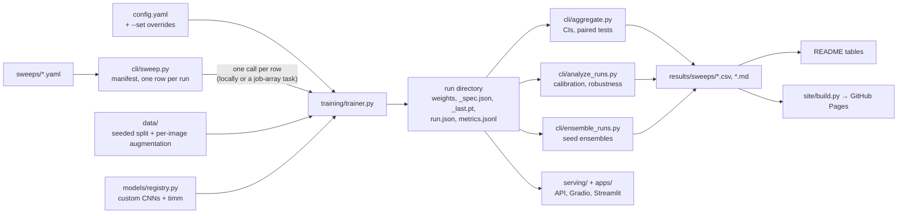

# Architecture

How the code is organised, how a result travels from a config file to the
README and website, and the design decisions worth knowing before changing
anything. For what each part does see the [feature guide](FEATURES.md); for
commands see the [usage guide](USAGE_GUIDE.md).

## The pipeline at a glance

## Layers

| Layer | Package | Responsibility |
|---|---|---|
| Configuration | `src/config/` | Load `config.yaml` into attribute-style objects; `get`/`set` by dotted key, used by `--set` |
| Data | `src/data/` | Download and split Fashion-MNIST (`preparation.py`), datasets and loaders with seeded splits (`dataset.py`), augmentation (`augmentation.py`) |
| Models | `src/models/` | Custom CNNs (`architectures.py`), the registry that builds any model and records its spec (`registry.py`), ensembles (`ensemble.py`), the older transfer-learning wrapper (`transfer.py`) |
| Training | `src/training/` | The training loop and CLI (`trainer.py`), seeding (`reproducibility.py`), per-step metrics and device selection (`utils.py`), run tracking (`experiment.py`), grid search (`tuner.py`) |
| Evaluation | `src/evaluation/` | Single-checkpoint evaluation (`evaluate.py`, `metrics.py`), calibration / per-class / robustness analysis (`analysis.py`), Grad-CAM (`explainability.py`) |
| Experiments | `src/cli/` | Thin entry points plus the study tools: `sweep.py`, `aggregate.py`, `analyze_runs.py`, `ensemble_runs.py` |
| Serving | `src/serving/`, `apps/`, `docker/` | Image preprocessing, inference and checkpoint loading (`inference.py`), the FastAPI app (`api.py`), Gradio and Streamlit demos, containers |
| Monitoring | `src/monitoring/` | Rolling metrics, input-drift detection, prediction statistics for a deployed model |
| Publication | `results/sweeps/`, `site/` | Committed per-run and summary tables; the website generator |

Package dependencies, as imported today:

| Package | Imports from |
|---|---|
| `cli` | `training`, `evaluation`, `models`, `data` |
| `training` | `models`, `data`, `config` |
| `evaluation` | `models` |
| `serving` | `models`, `config` |
| `data` | `training.reproducibility` only, a leaf module with no project imports |
| `models`, `config`, `monitoring` | nothing in the project |

Nothing in `src/` imports from `apps/` or `site/`, and only `cli` modules
import other `cli` modules.

## One training run

`python src/cli/train.py --model tinyvgg --seed 0` goes through
`training/trainer.py:main`:

1. **Configure.** Load `config.yaml`, apply `--set KEY=VALUE` overrides and
   the shortcut flags (`--epochs`, `--amp`, ...), then call `set_seed`, which
   seeds Python, NumPy, torch, CUDA and MPS before any model or data code runs.
2. **Load data.** `create_dataloaders(seed=...)` splits the official 60,000
   training images 48,000 / 12,000 with a seeded generator and seeds the
   shuffle order and worker processes, so the same seed gives the same split
   and order every time.
3. **Build the model.** `get_model` turns the name into a `ModelSpec`
   (architecture, pretrained, input size, frozen backbone) and asks the
   registry to build it. Custom CNNs take 28 × 28 input directly; timm
   backbones are wrapped in `TimmClassifier`, which upsamples.
4. **Train.** `train_model` runs epochs of per-image augmentation, optional
   Mixup/CutMix, optional mixed precision and gradient clipping. After each
   epoch it evaluates on the validation split, saves the best weights with
   their `_spec.json`, writes a full resume state to `_last.pt`, and appends a
   line to `metrics.jsonl`.
5. **Test once.** After early stopping, the best-validation checkpoint is
   evaluated once on the official test set. The summary goes into `run.json`
   together with the git commit, full config, command line, device and host.

## One study

A study (`sweeps/*.yaml`) expands into a manifest of independent rows, each a
complete `train.py` invocation with its own seed, output directory and
overrides. `sweep.py run --index N` executes row N in-process, which is what a
SLURM array task calls; every row runs with `--resume`, so resubmitting a
failed or pre-empted task continues it. Because runs share nothing but the
data, any number can run at once.

The analysis tools then read only the run directories:

- `aggregate.py` reads every `run.json` under a root, groups runs by
  `model|variant[|grid]`, and reports mean, standard deviation, a t-based 95%
  confidence interval and, with `--baseline`, paired differences and paired
  t-tests over the seeds two groups share.
- `analyze_runs.py` rebuilds each model from its spec, recreates that run's
  validation split from its seed (for temperature scaling) and runs the full
  analysis.
- `ensemble_runs.py` averages the softmax outputs of each group's checkpoints.

Their CSV and Markdown output is committed to `results/sweeps/`, which is
the single source for the README tables and the website.

## Design decisions

**Every checkpoint describes itself.** Weights are always saved with a
`_spec.json` from the registry, so evaluation, analysis, ensembles, the API
and the apps can rebuild any model, custom or timm, without being told what it
is. Adding a model to the registry makes it usable everywhere.

**One seed controls everything that is random.** Initialisation, the
train/validation split, data order, augmentation draws and worker processes
all derive from `training.seed`. That is what makes paired comparisons across
variants valid: a variant and its baseline see the same split and order.

**Metrics are counted per sample.** Loss and accuracy accumulate correct
counts and summed loss weighted by batch size, then divide by the number of
samples. An earlier per-batch average over-weighted the final partial batch.

**Augmentation is per image, in normalised space.** Random crop, flip and
rotation draw independently for every image, and pixels exposed by padding or
rotation take the normalised value of black. An earlier implementation drew
once per batch and padded with grey; `augmentation.legacy_batch_mode`
reproduces it exactly so its effect could be measured.

**Runs are provenance-first.** `run.json` records the git commit (and whether
the tree was dirty), the resolved config, the command line, host, scheduler
job ids and device. MLflow and Weights & Biases are optional mirrors of the
same information, never the source of truth.

**Results are data, and the website is built from them.** `site/build.py`
uses only the standard library, reads only `results/sweeps/`, and is rebuilt
by a GitHub Actions workflow on every push that changes results, so the site
cannot drift from the committed numbers.

**Documentation is tested.** The Python examples in the feature guide are
executed by `tests/test_docs_examples.py`, and `tests/test_cli_reference.py`
checks that the command-line reference lists every flag.

**Cluster specifics stay out of the repository.** `cluster/slurm/` holds
generic templates; a site's partition, QOS, node list and paths belong in the
git-ignored `cluster/local/`.

## Extending the project

- **A new model:** add a class to `architectures.py` and a branch in
  `registry.build_from_spec`, or just use any timm id. Everything downstream
  works through the spec file.
- **A new augmentation:** add it to `augmentation.py`, map a config key to it
  in `trainer.build_augmentation_pipeline`, and make it draw per image.
- **A new study:** copy a file in `sweeps/`; any config key can be a variant
  or grid axis and any `train.py` flag can go in `base_args`.
- **A new evaluation metric:** add a pure function over logits and labels to
  `evaluation/analysis.py` and include it in `run_full_analysis`;
  `analyze_runs.py` then computes it for every checkpoint.

## Tests

`tests/` mirrors the layers: models and registry, seeding and metric
accumulation, training with resume and mixed precision, per-image
augmentation (including regression tests for both bugs described above),
calibration and robustness analysis, sweeps and aggregation, batch analysis
and ensembles, inference and the API, the website generator, the documented
examples and the command-line reference. CI runs the suite on Python 3.10 and
3.11 for every push and pull request.
